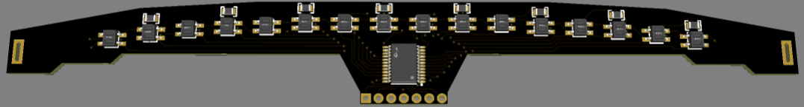
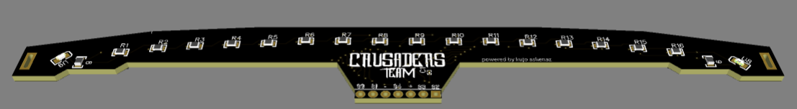

# Line-Follower-Sensor-Bar
# 16-Channel Multiplexed Line Sensor Bar

Custom **16-channel sensor array** designed for **line-following robots**.

The board uses a **74HC4067DB analog multiplexer** to read 16 infrared sensors using a reduced number of microcontroller inputs.

## Features

* 16 infrared line sensors
* 74HC4067DB analog multiplexer
* Analog sensor acquisition
* Compact PCB designed for line-following applications
* Reduced microcontroller I/O usage
* Designed for high-speed line detection and control

The multiplexer sequentially selects each sensor channel, allowing the microcontroller to scan all **16 sensors** through a single analog input while controlling the channel selection through four digital address lines.

## Applications

* Line-following robots
* High-resolution line detection
* Autonomous robotics
* Sensor-array experimentation
* PID-based line tracking

## Technologies

* 74HC4067DB
* Infrared sensors
* Analog signal processing
* Embedded systems
* PCB design

## 3D Model Design

